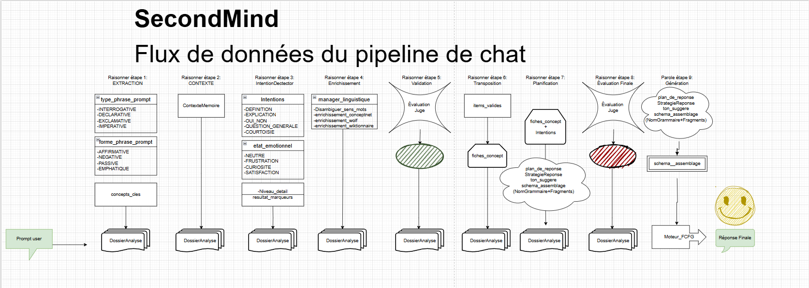
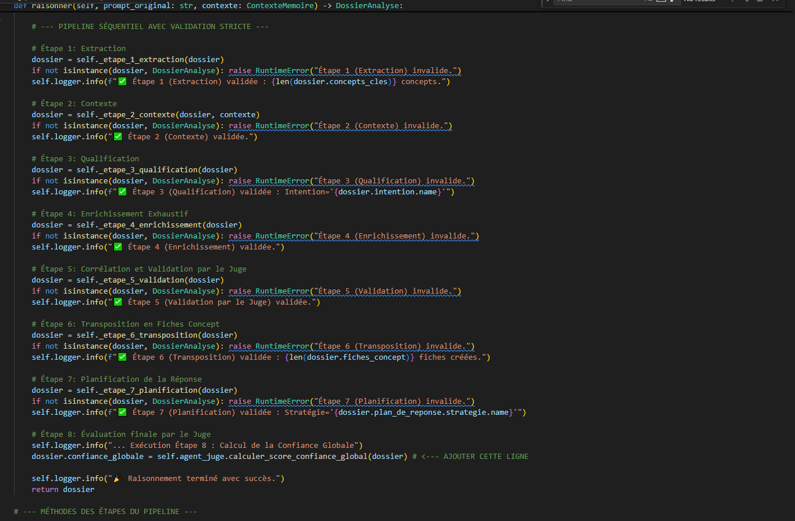
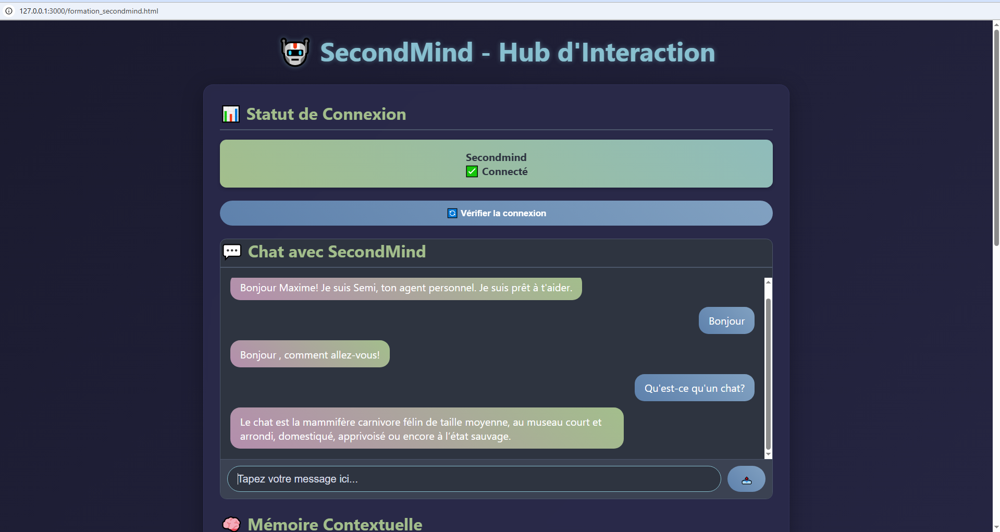

# 🧠 Origine du Projet : Architecture Cognitive Avant les LLM

Avant d’être un système d’orchestration de modèles de langage, **SecondMind est né comme un cerveau symbolique**.

En un mois, j’ai conçu et implémenté un pipeline cognitif complet à partir de zéro, sans dépendre de frameworks préexistants, en m’appuyant sur des fondations issues de l’IA symbolique et de la linguistique computationnelle :

- **Graphes conceptuels** (ConceptNet)
- **Sémantique lexicale** (WordNet, WOLF, Wiktionnaire)
- **Désambiguïsation du sens** (algorithme de Lesk)
- **Inférence symbolique**
- **Planification explicite de la réponse**
- **Génération linguistique contrôlée par grammaires formelles (CFG)**

À cette étape, les LLM n’étaient **pas le cerveau**, mais au mieux une surface d’expression.
La cognition, elle, était **déterministe, traçable et inspectable**.

Ce travail a posé les fondations conceptuelles de SecondMind :
- séparation stricte entre **raisonnement**, **validation**, **planification** et **génération**
- représentation explicite de l’état cognitif
- refus du raisonnement implicite non contrôlé

L’architecture actuelle de SecondMind est l’évolution naturelle de ce premier cerveau :
les LLM y sont intégrés comme **moteurs probabilistes spécialisés**, insérés dans des **protocoles de raisonnement symboliques et métacognitifs** que je conçois et gouverne.

# 🧠 **Pipeline Symbolique Cognitif**

### **Objectif de ce document**

Montrer concrètement comment SecondMind implémente un pipeline de raisonnement symbolique gouverné, destiné à encadrer, structurer et fiabiliser les modèles de langage (LLM).

Ce document décrit un système cognitif artificiel, composé de modules spécialisés, coopérant selon des règles strictes, avec validation continue et mémoire persistante.

### 🎯 Problème adressé

Les LLM sont puissants mais fondamentalement :

- probabilistes

- non déterministes

- sensibles aux hallucinations

- aveugles à leur propre cohérence globale

SecondMind part d’un postulat clair :

Un LLM ne doit jamais être autorisé à “raisonner seul”.
Il doit être orchestré, contraint et validé par une architecture symbolique explicite.

🧩 Principe fondamental : Orchestration Cognitive en Étapes Discrètes

Le cœur de SecondMind repose sur un **pipeline cognitif séquentiel**, dans lequel chaque étape :

- a un rôle cognitif clair

- produit une structure de données typée (DossierAnalyse)

- est validée strictement avant de passer à la suivante

- peut provoquer un arrêt immédiat en cas d’incohérence

Ce choix est volontairement opposé aux chaînes de raisonnement implicites des LLM.

## [🔁 Vue d’ensemble du pipeline](Images/diagramme_flux_symbolique.png)

  

Le pipeline complet est orchestré par AgentRaisonnement et se déroule en 8 étapes cognitives :

1. Extraction

2. Contextualisation mémoire

3. Qualification cognitive

4. Enrichissement sémantique exhaustif

5. Validation par jugement symbolique

6. Transposition en Fiches Concept

7. Planification de la réponse

8. Évaluation finale & score de confiance

Chaque étape est atomique, testable et loguée.

## [🧠 Détail des Étapes Cognitives](Images/etapes_pipeline_symbolique.png)

  

1️⃣ Extraction — Comprendre la forme avant le sens

- Analyse grammaticale (SpaCy / NLTK)

- Détection du type et de la forme du prompt

- Extraction des concepts clés

- Aucun enrichissement à ce stade

➡️ Objectif : figer la structure brute de la demande

2️⃣ Contexte — Mémoire avant raisonnement

- Récupération du contexte pertinent depuis la mémoire

- Pondération par récence et pertinence

- Injection contrôlée dans le dossier cognitif

➡️ Le raisonnement ne démarre jamais en mémoire zéro

3️⃣ Qualification — Intention, émotion, granularité

- Détection d’intention (symbolique + neuronal)

- Analyse de l’état émotionnel

- Estimation du niveau de détail attendu

➡️ Cette étape conditionne la stratégie de réponse future

4️⃣ Enrichissement — Sémantique profonde multi-sources

# Pipeline d’enrichissement symbolique :

- Désambiguïsation lexicale (Lesk / WSD)

- ConceptNet (relations, graphes conceptuels)

- WOLF / WordNet (synsets, hyperonymie)

- Wiktionnaire (définitions humaines)

- Lexique383 (informations morphologiques)

➡️ Tous les enrichissements sont corrélés, pas empilés

5️⃣ Validation — Le doute structuré

Rôle de AgentJuge :

- Détection de contradictions

- Détection de boucles logiques

- Évaluation de cohérence, pertinence, complétude, clarté

- Rejet immédiat si seuils non atteints

➡️ Fail fast plutôt qu’hallucination silencieuse

6️⃣ Transposition — Du raisonnement vers la structure

- Conversion des faits validés en Fiches Concept

- Données normalisées, traçables, réutilisables

- Base de la génération future

➡️ Le système pense en structures, pas en phrases

7️⃣ Planification — Penser avant parler

- Choix de la stratégie de réponse

- Définition du ton

- Construction d’un schéma d’assemblage grammatical

➡️ Aucune phrase n’est générée à ce stade

8️⃣ Évaluation Finale — Méta-cognition

- Calcul d’un score de confiance global

- Journalisation complète du raisonnement

- Injection dans la mémoire réflexive

➡️ Le système apprend de ses propres échecs

## 🧠 Génération Linguistique : CFG + Symbolique

Contrairement à une génération purement neuronale :

Les phrases sont générées via un moteur CFG

Les concepts sont injectés dans des structures grammaticales

Le LLM est utilisé comme outil local, pas comme décideur

➡️ Résultat : génération contrôlée, cohérente et explicable

## 🛡️ Gouvernance & Robustesse

Ce pipeline est :

- audité par analyse AST (AgentAuditor)

- protégé contre les boucles (LoopBreaker)

- surveillé post-génération (AgentReflexor)

- entièrement logué et traçable

- Chaque décision peut être rejouée, inspectée, expliquée.

## 🧠 Pourquoi ce pipeline est “cognitif”

Parce qu’il implémente explicitement :

- séparation perception / mémoire / raisonnement / langage

- validation métacognitive

- raisonnement symbolique hybride

- apprentissage par introspection

Ce n’est pas un chatbot.
C’est une architecture de pensée artificielle gouvernée.

🔗 Positionnement

Ce pipeline n’a pas vocation à remplacer les LLM.
Il est conçu pour :

Les rendre fiables, auditables et exploitables en production.

“Les LLM génèrent.
Les systèmes cognitifs gouvernent.”

#  [Exemple en action du pipeline SANS LLM ](Images/exemple_interraction_pipeline_symbolique.png)

  

